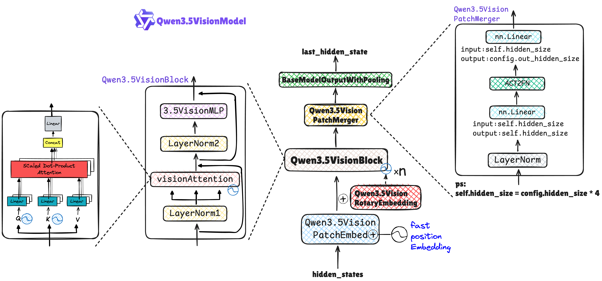
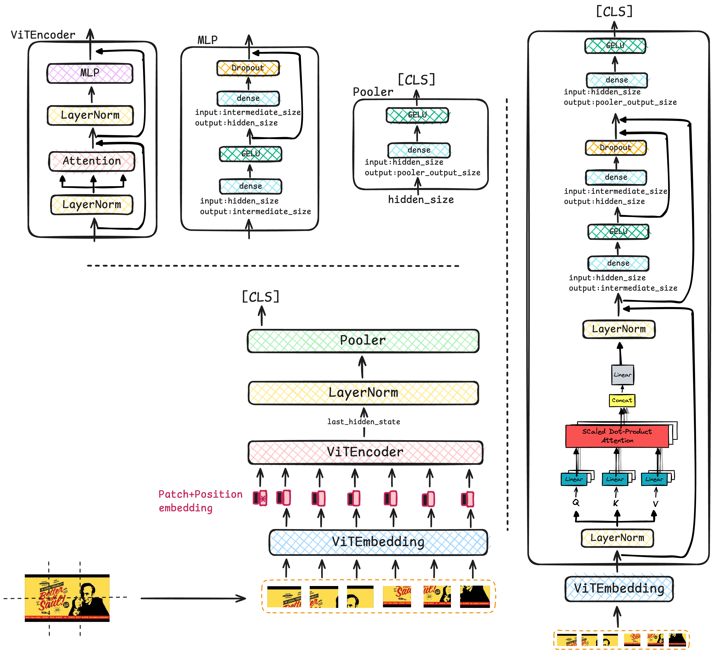
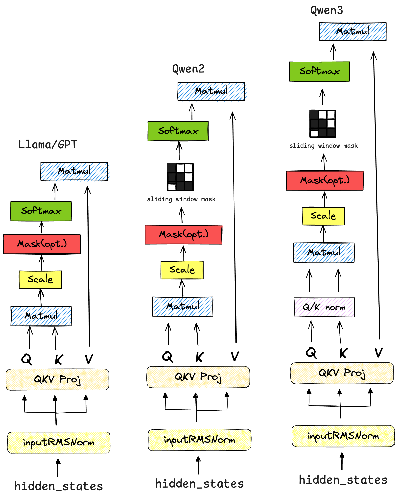
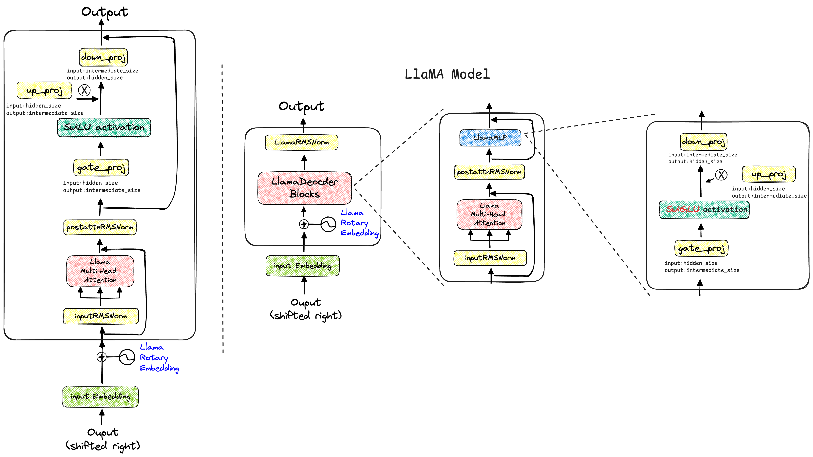
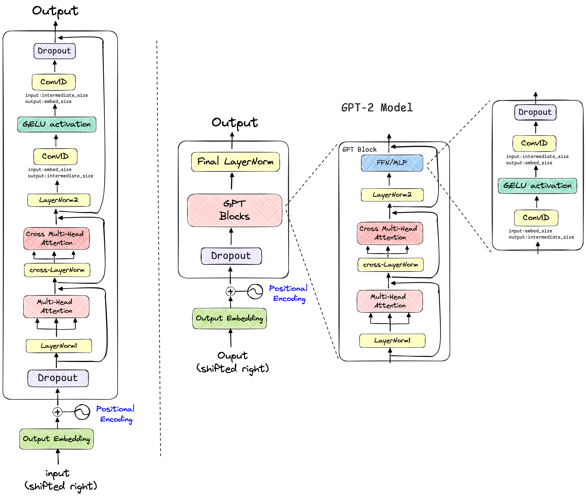
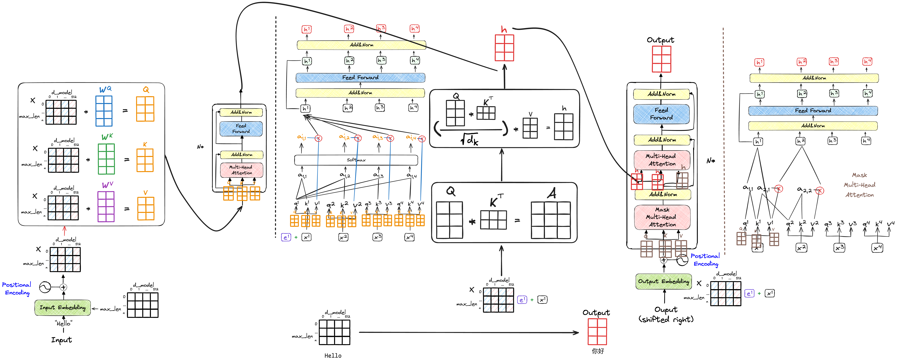

  <h1>🤖Hand-Drawn-LLM🤖</h1>

> Visualizing LLM Architecture Details using Excalidraw🎨🎨🎨

| Family | Model      | State  |
| ------ | ---------- | ------ |
| Qwen   | Qwen3.5    | update |
|        | Qwen2.5_VL | ✅      |
| Meta   | llama-2    | ✅      |
| OPENAI | GPT-2      | ✅      |
|        | CLIP       | ✅      |
| GOOGLE | ViT        | ✅      |
| GLM    | -          | update |

## Qwen3.5

Update......Currently under revision and refinement.

### Vision Encoder

## Qwen-VL

## CLIP

## ViT

## Qwen

> ✍️Qwen's architecture is similar to that of Llama; the key difference lies in the attention computation process.

## Llama

## GPT-2

## Attention

